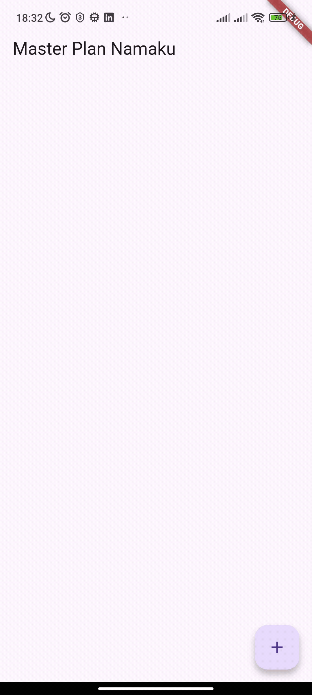
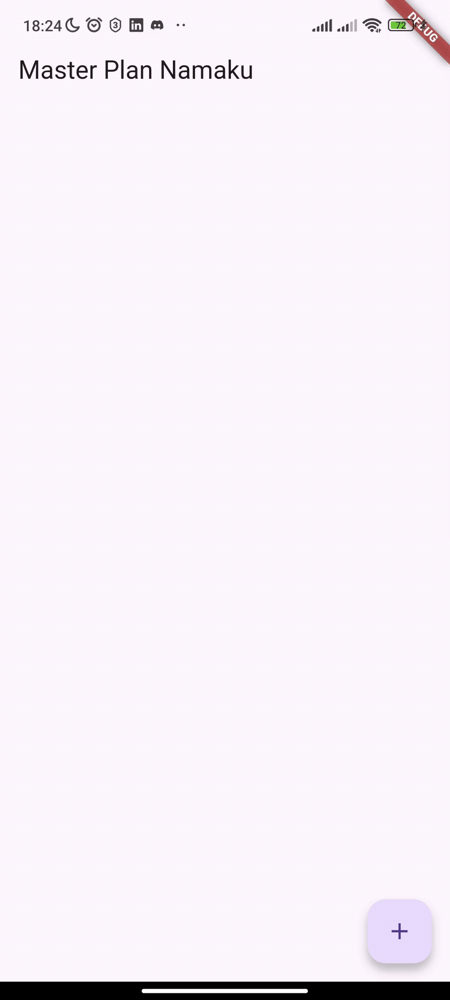

1. 
Jdi hasil akhir dari praktikum1 itu ada pada ux nya yang mana apabila keyboard virtual keluar, lalu kita melakukan scroll maka keyboard akan menutup sendiri

2. Langkah 4 (data_layer.dart):

Berfungsi sebagai barrel file untuk menyatukan beberapa ekspor (plan.dart, task.dart). Tujuannya agar file lain cukup impor satu file (data_layer.dart) saja, membuat kode lebih ringkas dan mudah dikelola.

3. Langkah 6 (variabel plan):
plan = const Plan(); adalah data utama (state) di screen. Menyimpan informasi rencana dan daftar tugas, dimulai dari objek kosong sebelum pengguna menambah tugas.

4. 
bisa mengetuk salah satu TextFormField untuk mengedit

Keyboard virtual akan muncul di layar.

Masalah: Jika di scroll daftar ke atas atau ke bawah (misalnya untuk melihat tugas lain) sambil keyboard masih terbuka, keyboard tersebut akan tetap terbuka.

5. Langkah 11 & 13 (initState dan dispose):

initState(): Dipanggil saat State pertama kali dibuat — digunakan untuk inisialisasi awal (misalnya controller).

dispose(): Dipanggil saat State dihapus — digunakan untuk membersihkan resource agar tidak terjadi memory leak.