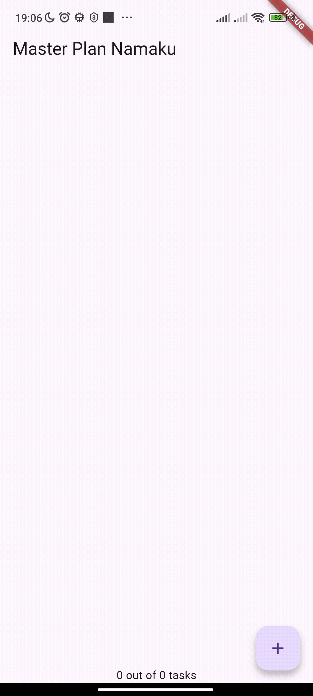
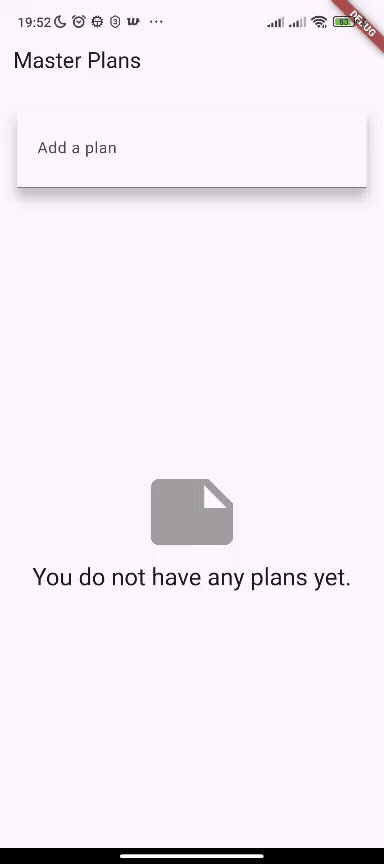

# Praktikum 1

1. 
Jdi hasil akhir dari praktikum1 itu ada pada ux nya yang mana apabila keyboard virtual keluar, lalu kita melakukan scroll maka keyboard akan menutup sendiri

2. Langkah 4 (data_layer.dart):

Berfungsi sebagai barrel file untuk menyatukan beberapa ekspor (plan.dart, task.dart). Tujuannya agar file lain cukup impor satu file (data_layer.dart) saja, membuat kode lebih ringkas dan mudah dikelola.

3. Langkah 6 (variabel plan):
plan = const Plan(); adalah data utama (state) di screen. Menyimpan informasi rencana dan daftar tugas, dimulai dari objek kosong sebelum pengguna menambah tugas.

4. 
bisa mengetuk salah satu TextFormField untuk mengedit

Keyboard virtual akan muncul di layar.

Masalah: Jika di scroll daftar ke atas atau ke bawah (misalnya untuk melihat tugas lain) sambil keyboard masih terbuka, keyboard tersebut akan tetap terbuka.

5. Langkah 11 & 13 (initState dan dispose):

initState(): Dipanggil saat State pertama kali dibuat — digunakan untuk inisialisasi awal (misalnya controller).

dispose(): Dipanggil saat State dihapus — digunakan untuk membersihkan resource agar tidak terjadi memory leak.

# Praktikum 2
1.  

2. PlanProvider adalah InheritedWidget-nya. Kita menggunakan InheritedNotifier karena dirancang khusus untuk membawa Listenable . ini memungkinkan widget turunan "mendengarkan" perubahan data secara efisien menggunakan ValueListenableBuilder, tanpa perlu merebuild seluruh layar.

3. itu adalah getter (metode) yang diletakkan di dalam class Model (Plan). bertujuan untuk menghitung data (seperti completedCount) dan membuat teks rangkuman (completenessMessage).

4.  
mengganti body statis dari Praktikum 1 dengan ValueListenableBuilder.

Hasilnya, UI sekarang secara otomatis memperbarui dirinya sendiri setiap kali menambah tugas atau mencentang checkbox. Ini terjadi secara efisien karena hanya widget di dalam builder ini yang direbuild, bukan seluruh halaman.

# Praktikum 3
1.  

2. Penjelasan Diagram: Diagram itu menunjukkan alur state management yang dibuat:

Panah ke Bawah (Build/Listen): View (Widgets/Layar) "mendengarkan" data dari Model (ValueNotifier). Saat data di Model berubah, builder di View otomatis dijalankan ulang untuk menampilkan data baru.

Panah ke Atas (onPressed/Update): Aksi pengguna (onPressed) di View memanggil fungsi yang memperbarui (mengubah) data di dalam Model (ValueNotifier).

3.  
Hasilnya adalah sebuah aplikasi multi-screen (2 layar) yang state-nya terkelola secara terpusat.

Layar 1 (PlanCreatorScreen): Berfungsi sebagai "halaman utama" tempat untuk membuat rencana baru dan melihat daftar semua rencana yang ada.

Layar 2 (PlanScreen): Adalah layar "detail"  yang muncul saat mengklik salah satu rencana di Layar 1. Layar ini menampilkan daftar to-do list spesifik untuk rencana tersebut.
