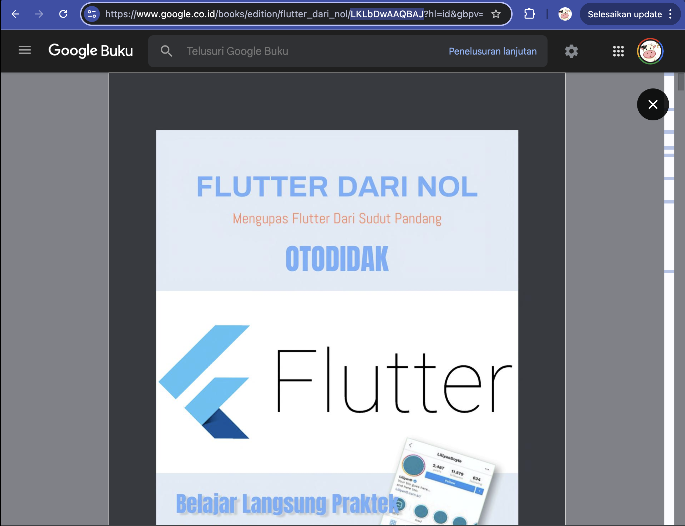
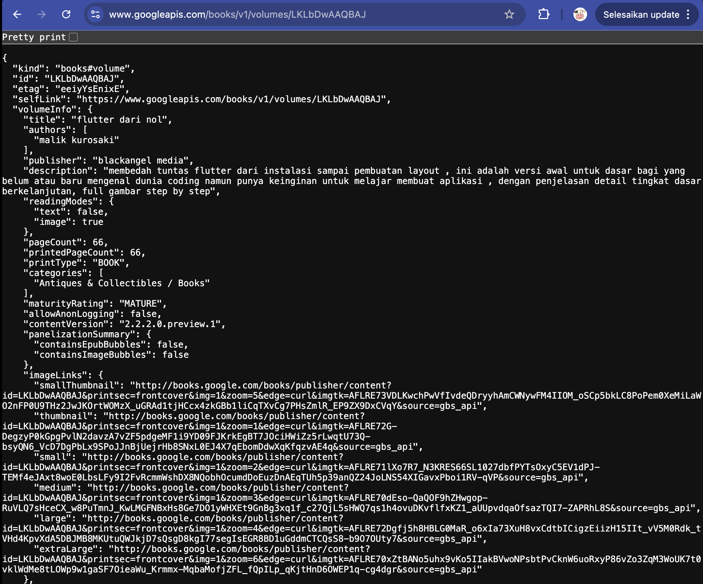
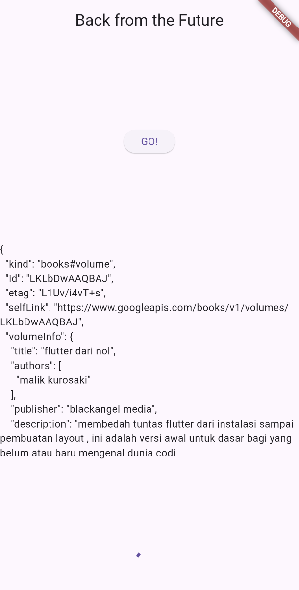
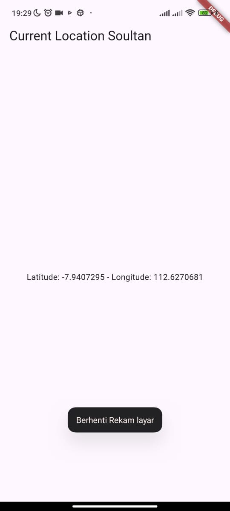

# Praktikum 1

Soal 1

```dart
import 'dart:async';

import 'package:flutter/material.dart';
import 'package:http/http.dart' as http;

void main() {
  runApp(const MyApp());
}

class MyApp extends StatelessWidget {
  const MyApp({super.key});

  @override
  Widget build(BuildContext context) {
    return MaterialApp(
      title: 'Soultan Mohammad Agnar Bisyarah',
      theme: ThemeData(
        primarySwatch: Colors.blue,
        visualDensity: VisualDensity.adaptivePlatformDensity,
      ),
      home: const FuturePage(),
    );
  }
}
```

Soal 2 

Mencari judul buku favorit:


Mencoba akses di browser


Soal 3

- .catchError((_) {}) berfungsi untuk error handler dan dipanggil saat Future gagal/error

- .substring(0, 450) Berfungsi untuk string function dan digunakan unruk Memotong teks hanya 450 karakter pertama

```dart
ElevatedButton(
    child: Text('GO!'),
    onPressed: () {
        setState(() {});
        getData()
            .then((value) {
        result = value.body.toString().substring(0, 450);
        setState(() {});
        }).catchError((_) {
        result = 'An error occurred';
        setState(() {});
        });
    },
    ),
```



# Praktikum 2

Soal 4
```dart
Future<int> returnOneAsync() async {
    await Future.delayed(const Duration(seconds: 3));
    return 1;
  }

  Future<int> returnTwoAsync() async {
    await Future.delayed(const Duration(seconds: 3));
    return 2;
  }

  Future<int> returnThreeAsync() async {
    await Future.delayed(const Duration(seconds: 3));
    return 3;
  }

  Future count() async {
    int total = 0;
    total = await returnOneAsync();
    total += await returnTwoAsync();
    total += await returnThreeAsync();
    setState(() {
      result = total.toString();
    });
  }
```

Tujuan dari fungsi return...Async adalah untuk mensimulasikan tiga pekerjaan terpisah yang masing-masing membutuhkan waktu 3 detik.

Tujuan dari fungsi count() adalah untuk menunjukkan bagaimana await memaksa pekerjaan-pekerjaan tersebut berjalan secara berurutan (sekuensial):

- Tunggu 3 detik untuk returnOneAsync().

- Lalu, tunggu 3 detik lagi untuk returnTwoAsync().

- Lalu, tunggu 3 detik lagi untuk returnThreeAsync().


Hasilnya, fungsi count() membutuhkan total 9 detik untuk selesai, lalu menampilkan hasil penjumlahannya ("6") di layar.

# Praktikum 3

Soal 5
```dart
late Completer completer;

Future getNumber() {
  completer = Completer<int>();
  calculate();
  return completer.future;
}

Future calculate() async {
  await Future.delayed(const Duration(seconds : 5));
  completer.complete(42);
}
```
Kode itu membuat Future manual dengan Completer.

- getNumber() membuat Completer<int>(), memanggil calculate(), lalu mengembalikan Future dari completer.

- calculate() menunggu 5 detik lalu memanggil completer.complete(42) → menandakan Future selesai dan hasilnya 42.


Soal 6
```
calculate() async {
    try {
      await new Future.delayed(const Duration(seconds : 5));
      completer.complete(42);
      // throw Exception();
    }
    catch (_) {
      completer.completeError({});
    }
  }
```
Perbedaan langkah 2 dengan langkah 5-6 adalah pada penanganan eror nya, pada calculate nomor 2 tidak ada handler untuk eror nya


# Praktikum 4
```dart
void returnFG() {
    FutureGroup<int> futureGroup = FutureGroup<int>();
    futureGroup.add(returnOneAsync());
    futureGroup.add(returnTwoAsync());
    futureGroup.add(returnThreeAsync());
    futureGroup.close();

    futureGroup.future.then((List<int> value) {
      int total = 0;
      for (var element in value) {
        total += element;
      }
      setState(() {
        result = total.toString();
      });
    });
  }
```
Soal 7


Soal 8
```dart
void returnFG() {
    // FutureGroup<int> futureGroup = FutureGroup<int>();
    // futureGroup.add(returnOneAsync());
    // futureGroup.add(returnTwoAsync());
    // futureGroup.add(returnThreeAsync());
  final futures = Future.wait<int>([
    returnOneAsync(),
    returnTwoAsync(),
    returnThreeAsync(),
  ]);
    futures.then((List<int> value) {
      int total = 0;
      for (var element in value) {
        total += element;
      }
      setState(() {
        result = total.toString();
      });
    });
  }
  ```

- Future.wait langsung menjalankan beberapa Future sekaligus dan selesai saat semua Future selesai.

- FutureGroup memberi kontrol manual: bisa menambah Future satu per satu, lalu memanggil close() untuk menandakan tidak ada Future tambahan lagi sebelum menunggu hasilnya.

# Praktikum 5

soal 9
```dart
Future returnError() async {
  await Future.delayed(const Duration(seconds: 2));
  throw Exception('Something terrible happened!');
}
```

```dart
returnError()
    .then((value){
  setState(() {
    result = 'Success';
  });
}).catchError((onError){
  setState(() {
    result = onError.toString();
  });
}).whenComplete(() => print('Complete'));
```


Soal 10
```dart
 Future handleError() async {
    try {
      await returnError();
    }
    catch (error) {
      setState(() {
        result = error.toString();
      });
    }
    finally {
      print('Complete');
    }
  }
```

Hasilnya akan muncul tulisan succes dan di terminal akan muncul tulisan complete

Perbedaan nya adalah: 

- returnError() hanya melempar error setelah 2 detik tanpa menanganinya.

- handleError() memanggil returnError() dan menangkap error-nya dengan try–catch, lalu menampilkan pesan error ke UI (setState) dan menjalankan finally setelah selesai.

# Praktikum 6

Soal 11

```dart
Widget build(BuildContext context) {
    return MaterialApp(
      title: 'Soultan Mohammad Agnar Bisyarah',
      theme: ThemeData(
        primarySwatch: Colors.blue,
        visualDensity: VisualDensity.adaptivePlatformDensity,
      ),
      home: const LocationScreen(),
    );
  }
```


Soal 12

Ketika menjalankan Flutter di browser, plugin geolocator otomatis:

1. Menggunakan JavaScript API:

navigator.geolocation.getCurrentPosition()

2. API ini meminta lokasi dari browser, yang bisa didapat dari:

- IP address (perkiraan lokasi)

- Wi-Fi network

- atau sensor GPS (jika perangkat mendukung, misal laptop dengan chip GPS)

Jadi meskipun kamu tidak menjalankan di HP, browser tetap bisa memberikan koordinat perkiraan — makanya kamu tetap dapat nilai latitude & longitude.


# Praktikum 7

Soal 13

FutureBuilder -> UI otomatis berubah sesuai status Future.

setState dengan myPosition -> UI diperbarui manual setelah data diperoleh.


Soal 14

Perbedaan UI hanya terlihat saat error terjadi.
Tambahan snapshot.hasError membuat aplikasi:

- Lebih informativ,

- Lebih ramah pengguna,

- Dan tidak crash saat data gagal dimuat.

UI nya hanya dapat dilihat ketika mengalami eror


# Praktikum 8

Soal 15

```dart
appBar: AppBar(
        title: const Text('Navigation First Screen Soultan'),
      ),
```

Soal 16

Hasilnya di UI:

- Klik tombol Red → background layar pertama jadi merah.

- Klik tombol Green → background jadi hijau.

- Klik tombol Blue → background jadi biru.

Karena:

- Navigator.push() membuka halaman baru dan menunggu hasil dari halaman itu (asynchronous).

- Navigator.pop(context, value) menutup halaman dan mengirimkan data kembali ke halaman sebelumnya.

- Dengan await dan setState(), halaman pertama bisa menerima hasil pilihan pengguna dan memperbarui tampilannya secara langsung.

