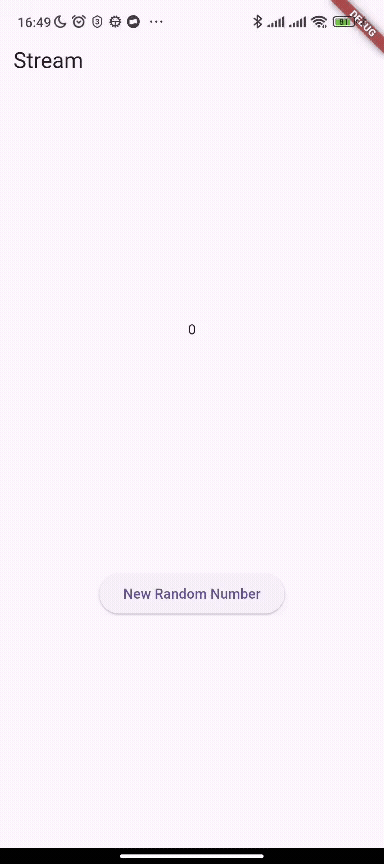

# Praktikum 1

Soal 1

```dart
  @override
  Widget build(BuildContext context) {
    return MaterialApp(
      title: 'Stream Soultan', //Stream nama
      theme: ThemeData(
        primarySwatch: Colors.lightBlue, // warna kesukaan
      ),
      home: const StreamHomePage(),
    );
  }
```

Soal 2

```dart
import 'package:flutter/material.dart';

class ColorStream {
  final List<Color> colors = [
  Colors.blueGrey,
  Colors.amber,
  Colors.deepPurple,
  Colors.lightBlue,
  Colors.teal,
  //tambahan warna baru
  Colors.green,
  Colors.blueAccent,
  Colors.pinkAccent,
  Colors.orangeAccent,
  Colors.purpleAccent
];
}
```

Soal 3
1. yield* digunakan untuk meneruskan/mengeluarkan seluruh event (data) dari satu Stream ke Stream lainnya.

yield* Stream.periodic(...) mengambil semua data yang dihasilkan Stream.periodic dan menjadikannya output dari getColorStream().

2. Apa maksud isi perintah kode tersebut?

```dart
Stream<Color> getColorStream() async* {
    yield* Stream.periodic(
      const Duration(seconds: 1), (int t) {
        int index = t % colors.length;
        return colors[index];
    });
  }
```
Kode tersebut membuat sebuah Stream yang mengeluarkan satu warna dari list colors setiap 1 detik secara berurutan dan berulang tanpa henti.

Soal 4


Soal 5

.listen(): Yaitu "berlangganan" ke Stream. Fungsi nya yaitu akan segera berlanjut dan selesai, tetapi callback (onData) akan dipanggil di background setiap kali ada data baru.

await for : Yaitu "menunggu" Stream. Fungsi nya yaitu akan berhenti (pause) di baris tersebut dan menunggu setiap event data satu per satu. Fungsi tidak akan berlanjut sampai Stream-nya selesai.

# Praktikum 2

Soal 6

kode 8

Menginisialisasi stream angka (NumberStream) → mendengarkan aliran datanya → memperbarui variabel lastNumber dan UI setiap kali ada angka baru.

kode 10

Fungsi addRandomNumber() menghasilkan angka acak (0–9) lalu mengirimnya ke stream agar bisa diproses atau ditampilkan oleh komponen lain (misalnya UI Flutter).





Soal 7

Tujuan utamanya adalah untuk mendemonstrasikan cara kerja penanganan error (error handling) pada sebuah Stream.

- Memicu Error (Kode 13): Tombol ElevatedButton sengaja diatur untuk memicu sebuah error (dengan memanggil addError()) alih-alih mengirim angka.

- Mengirim Error (Kode 15): Fungsi addError() memasukkan sebuah event error (string 'error') ke dalam "pipa" Stream menggunakan controller.sink.addError().

- Menangkap Error (Kode 14): Listener (stream.listen) yang ada di initState telah disiapkan dengan callback .onError. Callback ini akan menangkap error tersebut dan menjalankan setState untuk mengubah nilai lastNumber menjadi -1 sebagai tanda bahwa terjadi error.