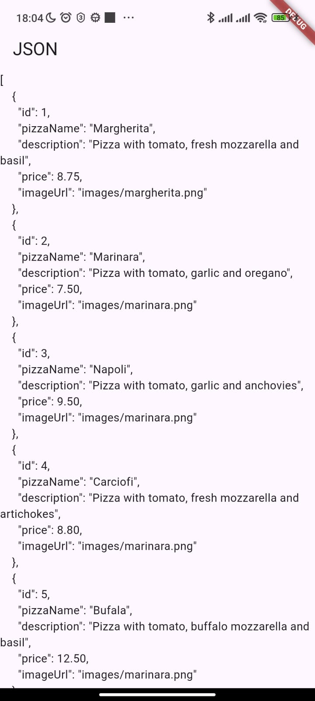

# Praktikum 1

Soal 1

```dart
  Widget build(BuildContext context) {
    return MaterialApp(
      title: 'Flutter JSON Demo Soultan',
      theme: ThemeData(
        primarySwatch: Colors.lightBlue,
      ),
      home: const MyHomePage(),
    );
  }
```

Soal 2


Soal 3
