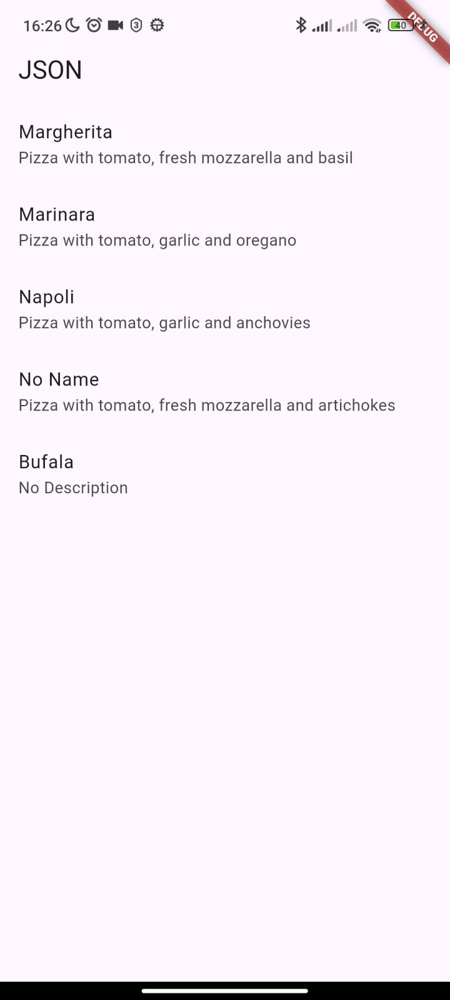

# Praktikum 1

Soal 1

```dart
  Widget build(BuildContext context) {
    return MaterialApp(
      title: 'Flutter JSON Demo Soultan',
      theme: ThemeData(
        primarySwatch: Colors.lightBlue,
      ),
      home: const MyHomePage(),
    );
  }
```

Soal 2


Soal 3


# Praktikum 2

Soal 4

```json
[ 
    { 
      "id": 1, 
      "pizzaName": "Margherita", 
      "description": "Pizza with tomato, fresh mozzarella and basil",
      "price": 8.75, 
      "imageUrl": "images/margherita.png" 
    }, 
    { 
      "id": 2, 
      "pizzaName": "Marinara", 
      "description": "Pizza with tomato, garlic and oregano",
      "price": 7.50, 
      "imageUrl": "images/marinara.png"  
    }, 
    { 
      "id": 3, 
      "pizzaName": "Napoli", 
      "description": "Pizza with tomato, garlic and anchovies",
      "price": 9.50, 
      "imageUrl": "images/marinara.png"  
    }, 
    { 
      "id": 4, 
      "pizzaName": null, 
      "description": "Pizza with tomato, fresh mozzarella and artichokes",
      "price": 8.80, 
      "imageUrl": "images/marinara.png"  
    }, 
    { 
      "id": 5, 
      "pizzaName": "Bufala", 
      "description": null,
      "price": "wlek", 
      "imageUrl": "images/marinara.png"  
    }
]
```
