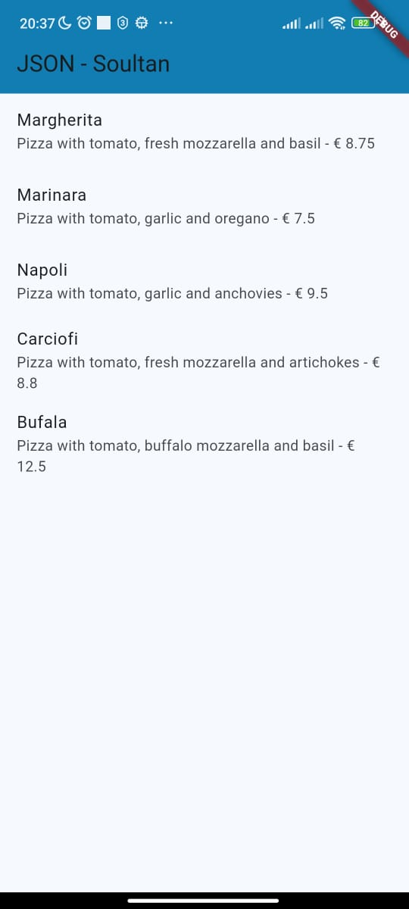
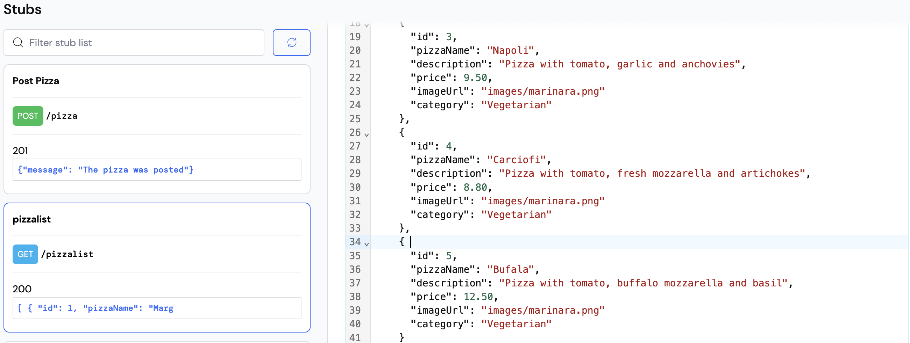
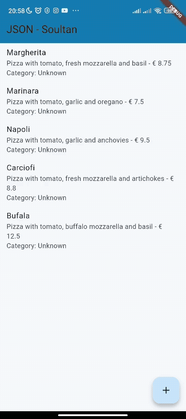

# Praktikum 1

Soal 1

```dart
appBar: AppBar(
        title: const Text('JSON - Soultan'),
        backgroundColor: const Color.fromARGB(255, 17, 125, 179),
      ),
```



# Praktikum 2


Soal 2

Menambahkan field baru yaitu category

```json
{ 
      "id": 4, 
      "pizzaName": "Carciofi", 
      "description": "Pizza with tomato, fresh mozzarella and artichokes",
      "price": 8.80, 
      "imageUrl": "images/marinara.png"
      "category": "Vegetarian"
    }, 
```


