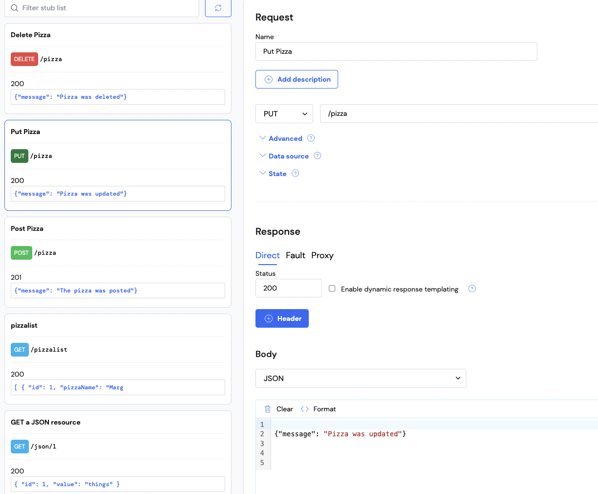
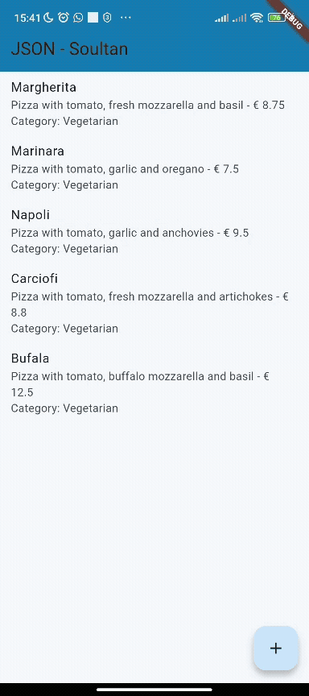
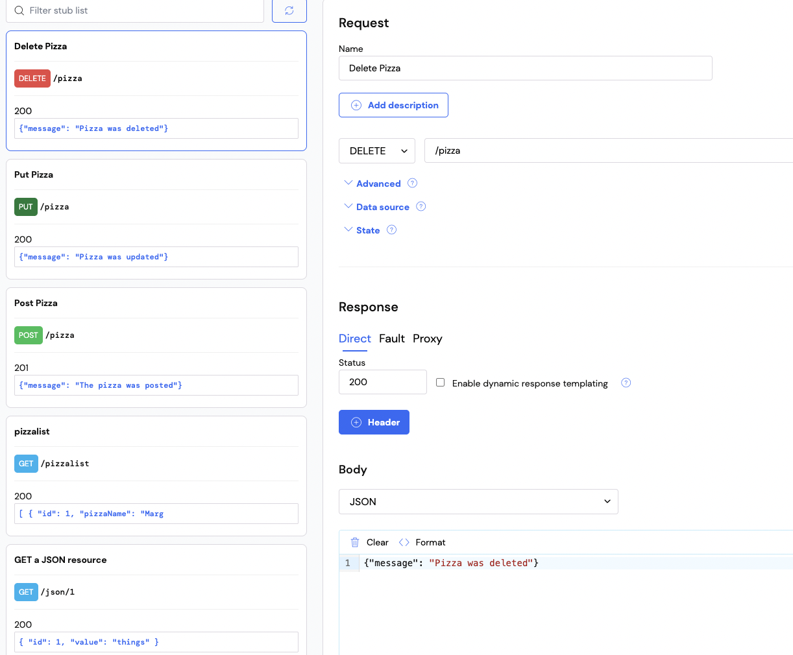
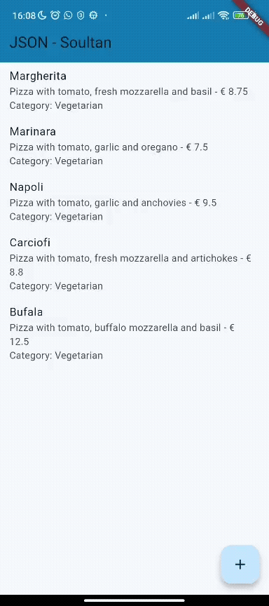

# Praktikum 1

Soal 1

```dart
appBar: AppBar(
        title: const Text('JSON - Soultan'),
        backgroundColor: const Color.fromARGB(255, 17, 125, 179),
      ),
```


# Praktikum 2


Soal 2

Menambahkan field baru yaitu category

```json
{ 
      "id": 4, 
      "pizzaName": "Carciofi", 
      "description": "Pizza with tomato, fresh mozzarella and artichokes",
      "price": 8.80, 
      "imageUrl": "images/marinara.png",
      "category": "Vegetarian"
    }, 
```


# Praktikum 3



Soal 3



# Praktikum 4



Soal 4 

kode untuk menghapus

```dart
return ListView.builder(
  itemCount: pizzas.length,
  itemBuilder: (BuildContext context, int position) {
    final pizza = pizzas[position];
    return Dismissible(
      key: Key(position.toString()),
      onDismissed: (item) {
        HttpHelper helper = HttpHelper();
        setState(() {
          pizzas.removeAt(position);
        });
        helper.deletePizza(pizza.id!);
      },
      child: ListTile(
        title: Text(pizza.pizzaName ?? 'No Name'),
        subtitle: Text(
          '${pizza.description ?? 'No Description'} - € ${pizza.price ?? 0.0}\nCategory: ${pizza.category ?? 'No Category'}',
        ),
        onTap: () {
          Navigator.push(
            context,
            MaterialPageRoute(
              builder: (context) =>
                  PizzaDetailScreen(pizza: pizza, isNew: false),
            ),
          );
        },
      ),
    );
  },
);
```

