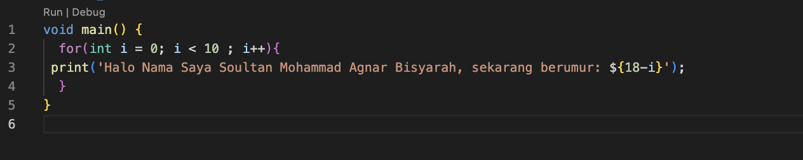
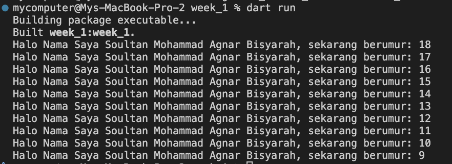
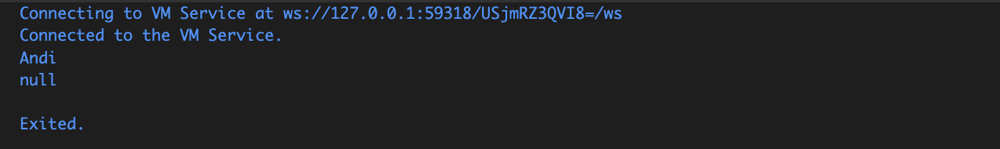

soal 1




Soal 2
Mengapa sangat penting untuk memahami bahasa pemrograman Dart sebelum kita menggunakan framework Flutter?

Jawaban:

karena framework Flutter sepenuhnya menggunakan bahasa pemrograman Dart.

Soal 3

Rangkuman materi dari codelab Flutter (poin-poin penting):

dasar bahasa dart
– arsitektur dan sejarah singkat Dart; bahasa yang menjadi dasar Flutter.

tooling & ekosistem dart
– tersedianya plugin, IDE, dan tools untuk analisis kode yang produktif.

memory management & tipe data
– garbage collector otomatis dan fitur type annotations untuk keamanan.

statically typed dengan fleksibilitas
– type safe dan type inference membantu mendeteksi banyak bug sejak compile time.

portabilitas
– dart dapat dikompilasi menjadi JavaScript untuk web atau ke native untuk mobile.

Soal 4

Perbedaan Null Safety dan Late Variabel dalam Dart

null safety adalah fitur Dart untuk mencegah error akibat nilai null yang tidak terduga, sedangkan late variabel adalah keyword late digunakan untuk menunda inisialisasi variabel, tetapi Dart tetap memastikan agar variabel tersebut akan diisi sebelum digunakan.

contoh null safety: 
```
void main() {
  String nama = "Andi"; 
  String? alamat;      

  print(nama);  
  print(alamat); 
}
```

pada variabel nama, tidak dapat null, namun untuk variabel alamat bisa null.


contoh late variabel: 
```
void main() {
  late String data;

  data = "Belajar Flutter";  
  print(data);
}
```

pada variabel data, bisa tidak di isi variabel nya terlebih dahulu, namun bisa harus tetap di isi, bisa digunakan untuk variabel yang berdasarkan inputan.


