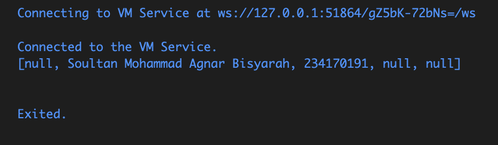
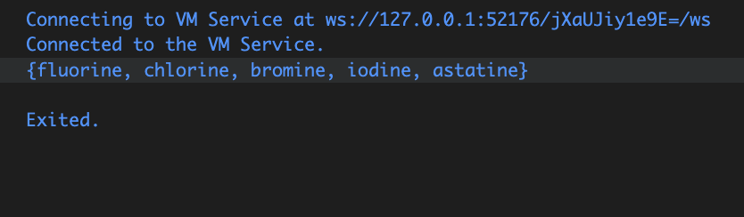
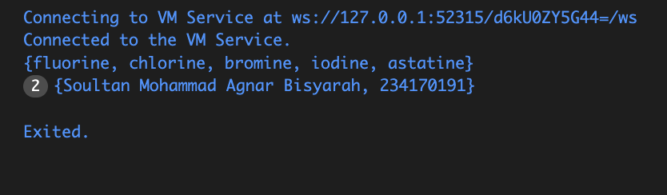
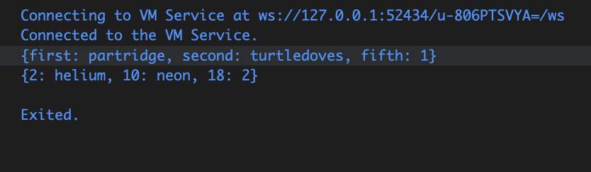
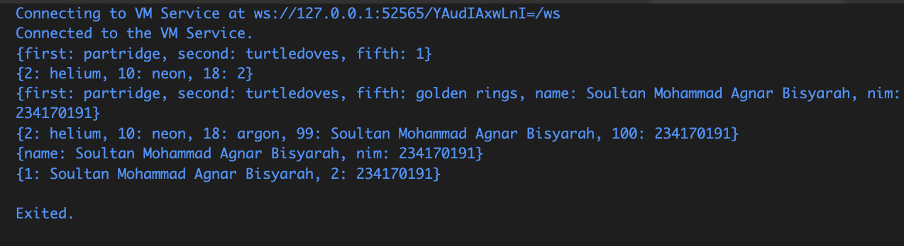

Nama : Soultan Mohammad Agnar Bisyarah
Kelas : TI-3H
NIM : 2341720191

# Praktikum 1

Langkah 1
```
void main (){
  var list = [1, 2, 3];
    assert(list.length == 3);
    assert(list[1] == 2);
      print(list.length);
      print(list[1]);

    list[1] = 1;
    assert(list[1] == 1);
      print(list[1]);

}
```

Langkah 2

Silakan coba eksekusi (Run) kode pada langkah 1 tersebut. Apa yang terjadi? Jelaskan!

Jawaban: Yang terjadi adalah program akan menampilkan angka 3 2 1 , pada program tersebut dilakukan pengecekan beberapa kali  menggunakan perintah assert

Langkah 3

Ubah kode pada langkah 1 menjadi variabel final yang mempunyai index = 5 dengan default value = null. Isilah nama dan NIM Anda pada elemen index ke-1 dan ke-2. Lalu print dan capture hasilnya.

Apa yang terjadi ? Jika terjadi error, silakan perbaiki.

Jawaban: nama dan nim akan di print pada indeks ke 1 dan 2, indeks lain yang tidak memiliki isi maka akan tertulis null
```
void main() {

  final List<String?> list = List.filled(5, null);

  list[1] = "Soultan Mohammad Agnar Bisyarah"; 
  list[2] = "234170191"; 


  print(list);
}

```


# Praktikum 2
 
Langkah 1

```
void main() {
  var halogens = {'fluorine', 'chlorine', 'bromine', 'iodine', 'astatine'};
  print(halogens);
}
```


Langkah 2

Silakan coba eksekusi (Run) kode pada langkah 1 tersebut. Apa yang terjadi? Jelaskan! Lalu perbaiki jika terjadi error.

Jawaban: Tidak ada eror, dapa yang di print bukan sebuah list melainkan set


Langkah 3
```
void main() {
  var halogens = {'fluorine', 'chlorine', 'bromine', 'iodine', 'astatine'};
  print(halogens);

  var names1 = <String>{};
    Set<String> names2 = {}; // This works, too.
    var names3 = {}; // Creates a map, not a set.

    print(names1);
    print(names2);
    print(names3);
}

```
Hasilnya berupa {} dan tidak ada isi nya


```
void main() {
  var halogens = {'fluorine', 'chlorine', 'bromine', 'iodine', 'astatine'};
  print(halogens);

  var names1 = <String>{};
  Set<String> names2 = {};

  names1.add("Soultan Mohammad Agnar Bisyarah"); 
  names1.add("234170191"); 

  names2.addAll({"Soultan Mohammad Agnar Bisyarah", "234170191"}); 

  print(names1);
  print(names2);
}
```



Jawaban:
names1 berhasil ditambah elemen dengan .add(), names2 berhasil ditambah elemen dengan .addAll(), dan keduanya menampilkan isi Set berisi nama serta NIM (tanpa duplikat).

# Praktikum 3

Langkah 1
```
void main() {
  var gifts = {
  // Key:    Value
  'first': 'partridge',
  'second': 'turtledoves',
  'fifth': 1
};

var nobleGases = {
  2: 'helium',
  10: 'neon',
  18: 2,
};

print(gifts);
print(nobleGases);
}
```


Langkah 2

tidak ada error, tapi lebih baik dituliskan dengan tipe Map<...> agar jelas bahwa value bisa bermacam-macam

Langkah 3
```
void main() {
  var gifts = {
  // Key:    Value
  'first': 'partridge',
  'second': 'turtledoves',
  'fifth': 1
};

var nobleGases = {
  2: 'helium',
  10: 'neon',
  18: 2,
};

print(gifts);
print(nobleGases);

var mhs1 = Map<String, String>();
gifts['first'] = 'partridge';
gifts['second'] = 'turtledoves';
gifts['fifth'] = 'golden rings';

var mhs2 = Map<int, String>();
nobleGases[2] = 'helium';
nobleGases[10] = 'neon';
nobleGases[18] = 'argon';
}
```
 tidak terjadi eror, hanya saja tidak ada output dikarenan tidak ada pemanggilan


Tambahkan elemen nama dan NIM Anda pada tiap variabel di atas (gifts, nobleGases, mhs1, dan mhs2).

```
void main() {
  // Map awal
  var gifts = {
    'first': 'partridge',
    'second': 'turtledoves',
    'fifth': 1
  };

  var nobleGases = {
    2: 'helium',
    10: 'neon',
    18: 2,
  };

  print(gifts);
  print(nobleGases);

  var mhs1 = Map<String, String>();
  gifts['first'] = 'partridge';
  gifts['second'] = 'turtledoves';
  gifts['fifth'] = 'golden rings'; 

  var mhs2 = Map<int, String>();
  nobleGases[2] = 'helium';
  nobleGases[10] = 'neon';
  nobleGases[18] = 'argon'; 

  gifts['name'] = 'Soultan Mohammad Agnar Bisyarah';
  gifts['nim'] = '234170191';

  nobleGases[99] = 'Soultan Mohammad Agnar Bisyarah';
  nobleGases[100] = '234170191';

  mhs1['name'] = 'Soultan Mohammad Agnar Bisyarah';
  mhs1['nim'] = '234170191';

  mhs2[1] = 'Soultan Mohammad Agnar Bisyarah';
  mhs2[2] = '234170191';

  print(gifts);
  print(nobleGases);
  print(mhs1);
  print(mhs2);
}
```

