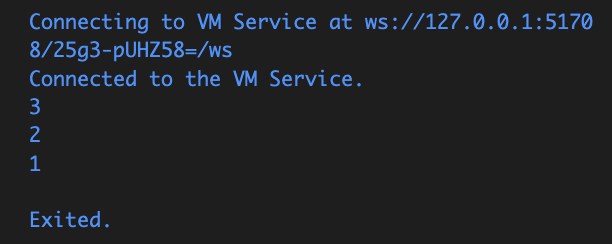
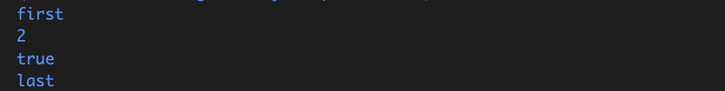

Nama : Soultan Mohammad Agnar Bisyarah
Kelas : TI-3H
NIM : 2341720191

# Praktikum 1

Langkah 1
```
void main (){
  var list = [1, 2, 3];
    assert(list.length == 3);
    assert(list[1] == 2);
      print(list.length);
      print(list[1]);

    list[1] = 1;
    assert(list[1] == 1);
      print(list[1]);

}
```

Langkah 2

Silakan coba eksekusi (Run) kode pada langkah 1 tersebut. Apa yang terjadi? Jelaskan!

Jawaban: Yang terjadi adalah program akan menampilkan angka 3 2 1 , pada program tersebut dilakukan pengecekan beberapa kali  menggunakan perintah assert

Langkah 3

Ubah kode pada langkah 1 menjadi variabel final yang mempunyai index = 5 dengan default value = null. Isilah nama dan NIM Anda pada elemen index ke-1 dan ke-2. Lalu print dan capture hasilnya.

Apa yang terjadi ? Jika terjadi error, silakan perbaiki.

Jawaban: nama dan nim akan di print pada indeks ke 1 dan 2, indeks lain yang tidak memiliki isi maka akan tertulis null
```
void main() {

  final List<String?> list = List.filled(5, null);

  list[1] = "Soultan Mohammad Agnar Bisyarah"; 
  list[2] = "234170191"; 


  print(list);
}

```


# Praktikum 2
 
Langkah 1

```
void main() {
  var halogens = {'fluorine', 'chlorine', 'bromine', 'iodine', 'astatine'};
  print(halogens);
}
```


Langkah 2

Silakan coba eksekusi (Run) kode pada langkah 1 tersebut. Apa yang terjadi? Jelaskan! Lalu perbaiki jika terjadi error.

Jawaban: Tidak ada eror, dapa yang di print bukan sebuah list melainkan set


Langkah 3
```
void main() {
  var halogens = {'fluorine', 'chlorine', 'bromine', 'iodine', 'astatine'};
  print(halogens);

  var names1 = <String>{};
    Set<String> names2 = {}; // This works, too.
    var names3 = {}; // Creates a map, not a set.

    print(names1);
    print(names2);
    print(names3);
}

```
Hasilnya berupa {} dan tidak ada isi nya


```
void main() {
  var halogens = {'fluorine', 'chlorine', 'bromine', 'iodine', 'astatine'};
  print(halogens);

  var names1 = <String>{};
  Set<String> names2 = {};

  names1.add("Soultan Mohammad Agnar Bisyarah"); 
  names1.add("234170191"); 

  names2.addAll({"Soultan Mohammad Agnar Bisyarah", "234170191"}); 

  print(names1);
  print(names2);
}
```


Jawaban:
names1 berhasil ditambah elemen dengan .add(), names2 berhasil ditambah elemen dengan .addAll(), dan keduanya menampilkan isi Set berisi nama serta NIM (tanpa duplikat).

# Praktikum 3

Langkah 1
```
void main() {
  var gifts = {
  // Key:    Value
  'first': 'partridge',
  'second': 'turtledoves',
  'fifth': 1
};

var nobleGases = {
  2: 'helium',
  10: 'neon',
  18: 2,
};

print(gifts);
print(nobleGases);
}
```


Langkah 2

tidak ada error, tapi lebih baik dituliskan dengan tipe Map<...> agar jelas bahwa value bisa bermacam-macam

Langkah 3
```
void main() {
  var gifts = {
  // Key:    Value
  'first': 'partridge',
  'second': 'turtledoves',
  'fifth': 1
};

var nobleGases = {
  2: 'helium',
  10: 'neon',
  18: 2,
};

print(gifts);
print(nobleGases);

var mhs1 = Map<String, String>();
gifts['first'] = 'partridge';
gifts['second'] = 'turtledoves';
gifts['fifth'] = 'golden rings';

var mhs2 = Map<int, String>();
nobleGases[2] = 'helium';
nobleGases[10] = 'neon';
nobleGases[18] = 'argon';
}
```
 tidak terjadi eror, hanya saja tidak ada output dikarenan tidak ada pemanggilan


Tambahkan elemen nama dan NIM Anda pada tiap variabel di atas (gifts, nobleGases, mhs1, dan mhs2).

```
void main() {
  // Map awal
  var gifts = {
    'first': 'partridge',
    'second': 'turtledoves',
    'fifth': 1
  };

  var nobleGases = {
    2: 'helium',
    10: 'neon',
    18: 2,
  };

  print(gifts);
  print(nobleGases);

  var mhs1 = Map<String, String>();
  gifts['first'] = 'partridge';
  gifts['second'] = 'turtledoves';
  gifts['fifth'] = 'golden rings'; 

  var mhs2 = Map<int, String>();
  nobleGases[2] = 'helium';
  nobleGases[10] = 'neon';
  nobleGases[18] = 'argon'; 

  gifts['name'] = 'Soultan Mohammad Agnar Bisyarah';
  gifts['nim'] = '234170191';

  nobleGases[99] = 'Soultan Mohammad Agnar Bisyarah';
  nobleGases[100] = '234170191';

  mhs1['name'] = 'Soultan Mohammad Agnar Bisyarah';
  mhs1['nim'] = '234170191';

  mhs2[1] = 'Soultan Mohammad Agnar Bisyarah';
  mhs2[2] = '234170191';

  print(gifts);
  print(nobleGases);
  print(mhs1);
  print(mhs2);
}
```


# Praktikum 4

Langkah 1 

```
void main() {
  var list = [1, 2, 3];
var list2 = [0, ...list];
print(list1);
print(list2);
print(list2.length);

}
```

Langkah 2 

Silakan coba eksekusi (Run) kode pada langkah 1 tersebut. Apa yang terjadi? Jelaskan! Lalu perbaiki jika terjadi error.

Jawaban: Eror karena list1 belum di definisikan

Langkah 3
```
void main() {
  var list = [1, 2, 3];
var list2 = [0, ...list];
print(list1);
print(list2);
print(list2.length);

list1 = [1, 2, null];
print(list1);
var list3 = [0, ...?list1];
print(list3.length);
}
```

Apa yang terjadi ? Jika terjadi error, silakan perbaiki.

Jawaban: Eror karena list1 belum diberi tipe data nya

Tambahkan variabel list berisi NIM Anda menggunakan Spread Operators. Dokumentasikan hasilnya dan buat laporannya!

```
void main() {
  var list = [1, 2, 3];
  var list1 = [1, 2, null];
  var list2 = [0, ...list];
  print(list1);
  print(list2);
  print(list2.length);

  print(list1);
  var list3 = [0, ...?list1];
  print(list3.length);

  var nim = ['2', '3', '4', '1', '7', '2', '0', '1', '9', '1'];
  var listNIM = [...nim];
  print(listNIM);
  print(listNIM.length);
}

```


Langkah 4
```
  var promoActive = true;
  var nav = ['Home', 'Furniture', 'Plants', if (promoActive) 'Outlet'];
print(nav);

```
Jika true maka outlet akan di tampilkan jika false maka outlet akan di sembunyikan

True


False


Langkah 5
```
var login = 'Manager'; 
  var nav2 = ['Home', 'Furniture', 'Plants', if (login == 'Manager') 'Inventory'];
  print(nav2);

```
Jika login= manager maka inventory akan di tampilkan, jika selain manager maka akan di sembunyikan


Langkah 6
```
 var listOfInts = [1, 2, 3];
  var listOfStrings = ['#0', for (var i in listOfInts) '#$i'];
  assert(listOfStrings[1] == '#1');
  print(listOfStrings);

```

Manfaat Collection for untuk mempermudah pembuatan list dari koleksi lain tanpa perlu loop terpisah. 

# Praktikum 5

Langkah 1
```
void main() {
  var record = ('first', a: 2, b: true, 'last');
print(record);

}
```


Langkah 2

Silakan coba eksekusi (Run) kode pada langkah 1 tersebut. Apa yang terjadi? Jelaskan! Lalu perbaiki jika terjadi error.

Jawaban: Eror dikarenakan kurang titik koma setelah print record

Langkah 3
```
void main() {
  var record = ('first', a: 2, b: true, 'last');
  print(record);
}

(int, int) tukar((int, int) record) {
  var (a, b) = record;
  return (b, a);
}
```

Apa yang terjadi ? Jika terjadi error, silakan perbaiki. Gunakan fungsi tukar() di dalam main() sehingga tampak jelas proses pertukaran value field di dalam Records.

Jawaban: Tidak terjadi eror, hanya saja fungsi tukar tidak terpakai, sehingga proses pertukaran nilai record tidak terlihat

Perbaikan
```
void main() {
  
  var record = ('first', a: 2, b: true, 'last');
  print('Record campuran: $record');

  var angka = (10, 20);
  print('Sebelum tukar: $angka');

  var hasil = tukar(angka);
  print('Sesudah tukar: $hasil');
}

(int, int) tukar((int, int) record) {
  var (a, b) = record;
  return (b, a);
}
```


Langkah 4
```
  (String, int) mahasiswa=('Soultan Mohammad Agnar Bisyarah', 234170191);
print(mahasiswa);
```
Apa yang terjadi ? Jika terjadi error, silakan perbaiki. Inisialisasi field nama dan NIM Anda pada variabel record mahasiswa di atas. Dokumentasikan hasilnya dan buat laporannya!

Jawaban: Awalnya terjadi eror karena mahasiswa belum memiliki value.


Langkah 5
```
var mahasiswa2 = ('first', a: 2, b: true, 'last');

print(mahasiswa2.$1); // Prints 'first'
print(mahasiswa2.a); // Prints 2
print(mahasiswa2.b); // Prints true
print(mahasiswa2.$2); // Prints 'last'
```



Apa yang terjadi ? Jika terjadi error, silakan perbaiki. Gantilah salah satu isi record dengan nama dan NIM Anda, lalu dokumentasikan hasilnya dan buat laporannya!
Jawaban: Tidak ada eror

```
  var mahasiswa2 = ('Soultan Mohammad Agnar Bisyarah', a: 2341720191, b: true, 'Mahasiswa');

  print(mahasiswa2.$1); 
  print(mahasiswa2.a);  
  print(mahasiswa2.b); 
  print(mahasiswa2.$2); 
```
