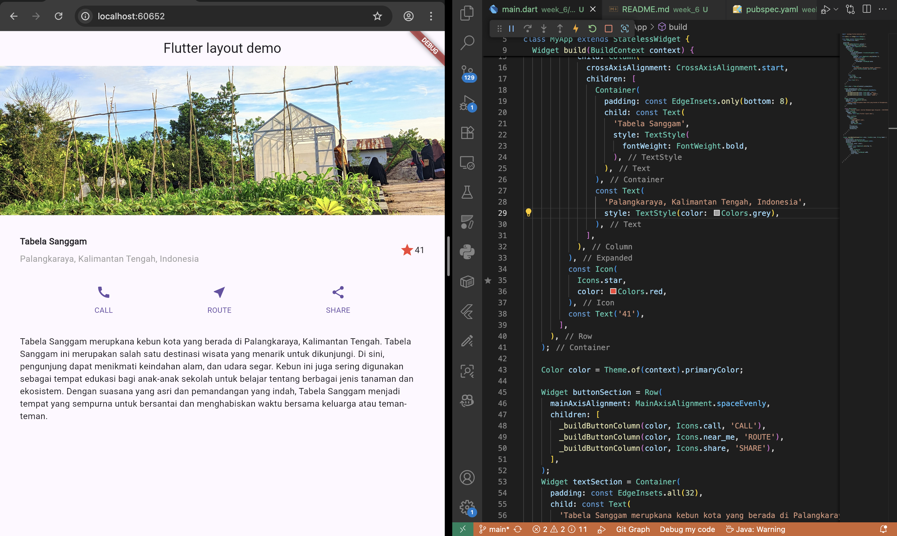

# week_6


# Tugas Praktikum 1
```
import 'package:flutter/material.dart';

void main() => runApp(const MyApp());

class MyApp extends StatelessWidget {
  const MyApp({super.key});

  @override
  Widget build(BuildContext context) {
    Widget titleSection = Container(
      padding: const EdgeInsets.all(32),
      child: Row(
        children: [
          Expanded(
            child: Column(
              crossAxisAlignment: CrossAxisAlignment.start,
              children: [
                Container(
                  padding: const EdgeInsets.only(bottom: 8),
                  child: const Text(
                    'Tabela Sanggam',
                    style: TextStyle(
                      fontWeight: FontWeight.bold,
                    ),
                  ),
                ),
                const Text(
                  'Palangkaraya, Kalimantan Tengah, Indonesia',
                  style: TextStyle(color: Colors.grey),
                ),
              ],
            ),
          ),
          const Icon(
            Icons.star,
            color: Colors.red,
          ),
          const Text('41'),
        ],
      ),
    );

    Color color = Theme.of(context).primaryColor;

    Widget buttonSection = Row(
      mainAxisAlignment: MainAxisAlignment.spaceEvenly,
      children: [
        _buildButtonColumn(color, Icons.call, 'CALL'),
        _buildButtonColumn(color, Icons.near_me, 'ROUTE'),
        _buildButtonColumn(color, Icons.share, 'SHARE'),
      ],
    );
    Widget textSection = Container(
      padding: const EdgeInsets.all(32),
      child: const Text(
        'Tabela Sanggam merupkana kebun kota yang berada di Palangkaraya, Kalimantan Tengah. Tabela Sanggam ini merupakan salah satu destinasi wisata yang menarik untuk dikunjungi. Di sini, pengunjung dapat menikmati keindahan alam, dan udara segar. Kebun ini juga sering digunakan sebagai tempat edukasi bagi anak-anak sekolah untuk belajar tentang berbagai jenis tanaman dan ekosistem. Dengan suasana yang asri dan pemandangan yang indah, Tabela Sanggam menjadi tempat yang sempurna untuk bersantai dan menghabiskan waktu bersama keluarga atau teman-teman.',
        softWrap: true,
      ),
    );

    return MaterialApp(
      title: 'Flutter layout: Soultan Mohammad Agnar Bisyarah - 2341720191',
      home: Scaffold(
        appBar: AppBar(
          title: const Text('Flutter layout demo'),
        ),
        body: ListView(  
          children: [
            Image.asset(
              'images/gambar1.jpeg',
              width: 600,
              height: 240,
              fit: BoxFit.cover,
            ),
            titleSection,
            buttonSection,
            textSection,
          ],
        ),
      ),
    );
  }

  Column _buildButtonColumn(Color color, IconData icon, String label) {
    return Column(
      mainAxisSize: MainAxisSize.min,
      mainAxisAlignment: MainAxisAlignment.center,
      children: [
        Icon(icon, color: color),
        Container(
          margin: const EdgeInsets.only(top: 8),
          child: Text(
            label,
            style: TextStyle(
              fontSize: 12,
              fontWeight: FontWeight.w400,
              color: color,
            ),
          ),
        ),
      ],
    );
  }
}

```

hasil
