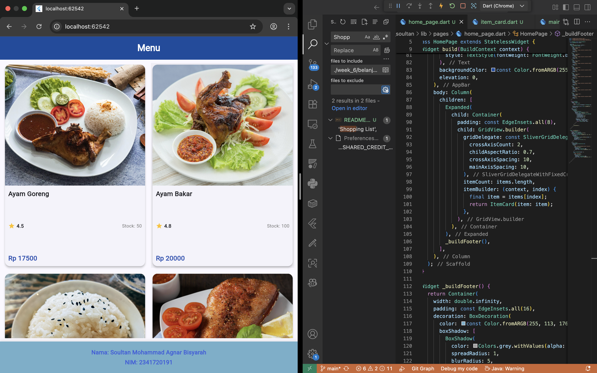
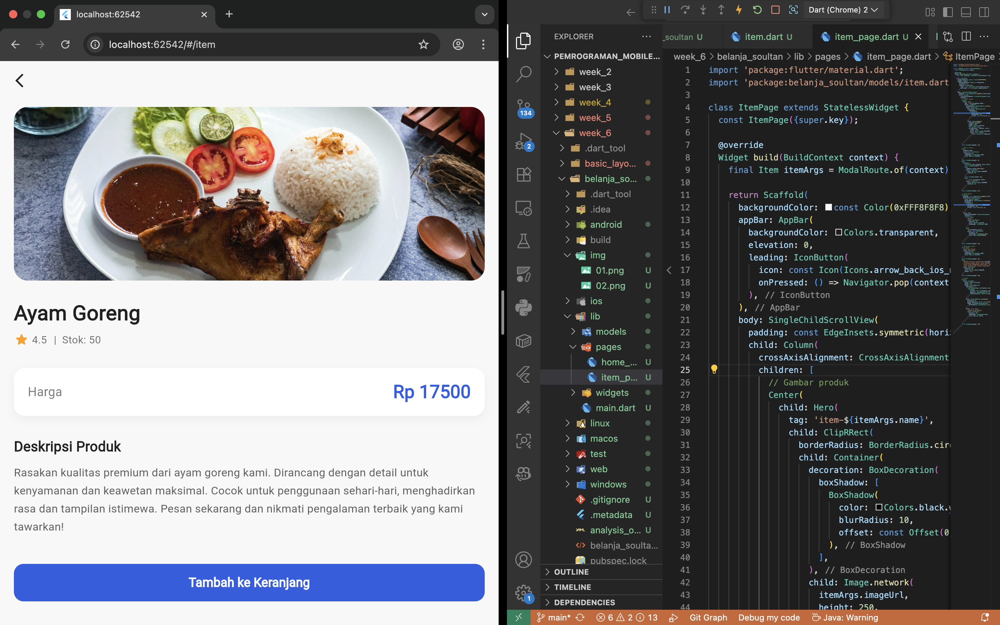

# belanja_soultan

A new Flutter project.

# Kode main.dart

```
import 'package:flutter/material.dart';
import 'package:belanja_soultan/pages/home_page.dart';
import 'package:belanja_soultan/pages/item_page.dart';

void main() {
  runApp(const MyApp());
}

class MyApp extends StatelessWidget {
  const MyApp({super.key});

  @override
  Widget build(BuildContext context) {
    return MaterialApp(
      debugShowCheckedModeBanner: false,
      theme: ThemeData(
        colorScheme: ColorScheme.fromSeed(seedColor: Colors.deepPurple),
        useMaterial3: true,
      ),
      initialRoute: '/',
      routes: {
        '/': (context) => const HomePage(),
        '/item': (context) => const ItemPage(),
      },
    );
  }
}
```

# item.dart
```
class Item {
  final String name;
  final int price;
  final String imageUrl;
  final int stock;
  final double rating;

  Item({
    required this.name,
    required this.price,
    required this.imageUrl,
    required this.stock,
    required this.rating,
  });
}
```

# home_page.dart
```
import 'package:flutter/material.dart';
import 'package:belanja_soultan/models/item.dart';
import 'package:belanja_soultan/widgets/item_card.dart';

class HomePage extends StatelessWidget {
  const HomePage({super.key});

  @override
  Widget build(BuildContext context) {
    final List<Item> items = [
      Item(
        name: 'Ayam Goreng',
        price: 17500,
        imageUrl:
            'https://images.unsplash.com/photo-1732185269471-b62b52ca46f9?q=80&w=2070&auto=format&fit=crop&ixlib=rb-4.1.0&ixid=M3wxMjA3fDB8MHxwaG90by1wYWdlfHx8fGVufDB8fHx8fA%3D%3D', //ayam
        stock: 50,
        rating: 4.5,
      ),
      Item(
        name: 'Ayam Bakar',
        price: 20000,
        imageUrl:
            'https://images.unsplash.com/photo-1645066803665-d16a79a21566?q=80&w=2070&auto=format&fit=crop&ixlib=rb-4.1.0&ixid=M3wxMjA3fDB8MHxwaG90by1wYWdlfHx8fGVufDB8fHx8fA%3D%3D', // ayam bakar
        stock: 100,
        rating: 4.8,
      ),
      Item(
        name: 'Nasi Putih',
        price: 14000,
        imageUrl:
            'https://images.unsplash.com/photo-1644131447497-8723db691320?q=80&w=1674&auto=format&fit=crop&ixlib=rb-4.1.0&ixid=M3wxMjA3fDB8MHxwaG90by1wYWdlfHx8fGVufDB8fHx8fA%3D%3D', 
        stock: 30,
        rating: 4.7,
      ),
      Item(
        name: 'Ikan Goreng',
        price: 22000,
        imageUrl:
            'https://images.unsplash.com/photo-1673436977947-0787164a9abc?q=80&w=2070&auto=format&fit=crop&ixlib=rb-4.1.0&ixid=M3wxMjA3fDB8MHxwaG90by1wYWdlfHx8fGVufDB8fHx8fA%3D%3D', 
        stock: 20,
        rating: 4.6,
      ),
      Item(
        name: 'Ikan Bakar',
        price: 24000,
        imageUrl:
            'https://images.unsplash.com/photo-1661939252817-ebb73304f4c7?q=80&w=2832&auto=format&fit=crop&ixlib=rb-4.1.0&ixid=M3wxMjA3fDB8MHxwaG90by1wYWdlfHx8fGVufDB8fHx8fA%3D%3D', 
        stock: 45,
        rating: 4.4,
      ),
      Item(
        name: 'Ice Tea',
        price: 5000,
        imageUrl:
            'https://images.unsplash.com/photo-1601390395693-364c0e22031a?q=80&w=2831&auto=format&fit=crop&ixlib=rb-4.1.0&ixid=M3wxMjA3fDB8MHxwaG90by1wYWdlfHx8fGVufDB8fHx8fA%3D%3D', 
        stock: 60,
        rating: 4.9,
      ),
      Item(
        name: 'Lemon Tea',
        price: 12000,
        imageUrl:
            'https://images.unsplash.com/photo-1556679343-c7306c1976bc?q=80&w=2899&auto=format&fit=crop&ixlib=rb-4.1.0&ixid=M3wxMjA3fDB8MHxwaG90by1wYWdlfHx8fGVufDB8fHx8fA%3D%3D',
        stock: 80,
        rating: 4.3,
      ),
      Item(
        name: 'Coffee Latte',
        price: 18000,
        imageUrl:
            'https://images.unsplash.com/photo-1585494156145-1c60a4fe952b?q=80&w=987&auto=format&fit=crop&ixlib=rb-4.1.0&ixid=M3wxMjA3fDB8MHxwaG90by1wYWdlfHx8fGVufDB8fHx8fA%3D%3D', 
        stock: 35,
        rating: 4.7,
      ),
    ];

    return Scaffold(
      appBar: AppBar(
        title: const Text(
          'Shopping List',
          style: TextStyle(fontWeight: FontWeight.bold, color: Colors.white),
        ),
        backgroundColor: Colors.deepPurple,
        elevation: 0,
      ),
      body: Column(
        children: [
          Expanded(
            child: Container(
              padding: const EdgeInsets.all(8),
              child: GridView.builder(
                gridDelegate: const SliverGridDelegateWithFixedCrossAxisCount(
                  crossAxisCount: 2,
                  childAspectRatio: 0.7,
                  crossAxisSpacing: 10,
                  mainAxisSpacing: 10,
                ),
                itemCount: items.length,
                itemBuilder: (context, index) {
                  final item = items[index];
                  return ItemCard(item: item);
                },
              ),
            ),
          ),
          _buildFooter(),
        ],
      ),
    );
  }

  Widget _buildFooter() {
    return Container(
      width: double.infinity,
      padding: const EdgeInsets.all(16),
      decoration: BoxDecoration(
        color: Colors.deepPurple.shade50,
        boxShadow: [
          BoxShadow(
            color: Colors.grey.withValues(alpha: 0.2),
            spreadRadius: 1,
            blurRadius: 5,
            offset: const Offset(0, -3),
          ),
        ],
      ),
      child: Column(
        mainAxisSize: MainAxisSize.min,
        children: [
          Text(
            'Nama: Soultan Mohammad Agnar Bisyarah',
            style: TextStyle(
              fontSize: 14,
              fontWeight: FontWeight.w600,
              color: Colors.deepPurple.shade700,
            ),
          ),
          const SizedBox(height: 4),
          Text(
            'NIM: 2341720191',
            style: TextStyle(
              fontSize: 14,
              fontWeight: FontWeight.w600,
              color: Colors.deepPurple.shade700,
            ),
          ),
        ],
      ),
    );
  }
}
```

# item_page
```
import 'package:flutter/material.dart';
import 'package:belanja_soultan/models/item.dart';

class ItemPage extends StatelessWidget {
  const ItemPage({super.key});

  @override
  Widget build(BuildContext context) {
    // Mengambil data Item yang dikirim lewat Navigator
    final Item itemArgs = ModalRoute.of(context)!.settings.arguments as Item;

    return Scaffold(
      body: CustomScrollView(
        slivers: [
          // Bagian header dengan efek scroll
          SliverAppBar(
            expandedHeight: 300, // tinggi maksimum saat di-expand
            pinned: true, // tetap tampil meskipun di-scroll
            backgroundColor: Colors.deepPurple,
            leading: IconButton(
              icon: const Icon(Icons.arrow_back, color: Colors.white),
              onPressed: () => Navigator.pop(context), // tombol back
            ),
            flexibleSpace: FlexibleSpaceBar(
              background: Hero(
                tag: 'item-${itemArgs.name}', // animasi Hero
                child: Image.network(
                  itemArgs.imageUrl,
                  fit: BoxFit.cover,
                  // Error handler jika gambar gagal dimuat
                  errorBuilder: (context, error, stackTrace) {
                    return Container(
                      color: Colors.grey.shade200,
                      child: const Center(
                        child: Icon(
                          Icons.image_not_supported,
                          size: 100,
                          color: Colors.grey,
                        ),
                      ),
                    );
                  },
                ),
              ),
            ),
          ),
          // Bagian isi konten produk
          SliverToBoxAdapter(
            child: Padding(
              padding: const EdgeInsets.all(16.0),
              child: Column(
                crossAxisAlignment: CrossAxisAlignment.start,
                children: [
                  // Nama Produk
                  Text(
                    itemArgs.name,
                    style: const TextStyle(
                      fontSize: 32,
                      fontWeight: FontWeight.bold,
                    ),
                  ),
                  const SizedBox(height: 16),
                  // Informasi Rating & Stock
                  Row(
                    children: [
                      _buildInfoCard(
                        icon: Icons.star,
                        label: 'Rating',
                        value: itemArgs.rating.toString(),
                        color: Colors.amber,
                      ),
                      const SizedBox(width: 12),
                      _buildInfoCard(
                        icon: Icons.inventory_2,
                        label: 'Stock',
                        value: itemArgs.stock.toString(),
                        color: Colors.blue,
                      ),
                    ],
                  ),
                  const SizedBox(height: 24),
                  // Informasi Harga
                  Container(
                    padding: const EdgeInsets.all(16),
                    decoration: BoxDecoration(
                      color: Colors.deepPurple.shade50,
                      borderRadius: BorderRadius.circular(12),
                    ),
                    child: Row(
                      mainAxisAlignment: MainAxisAlignment.spaceBetween,
                      children: [
                        const Text(
                          'Price',
                          style: TextStyle(
                            fontSize: 20,
                            fontWeight: FontWeight.w600,
                            color: Colors.grey,
                          ),
                        ),
                        Text(
                          'Rp ${itemArgs.price}',
                          style: const TextStyle(
                            fontSize: 28,
                            fontWeight: FontWeight.bold,
                            color: Colors.deepPurple,
                          ),
                        ),
                      ],
                    ),
                  ),
                  const SizedBox(height: 24),
                  // Deskripsi Produk
                  const Text(
                    'Product Description',
                    style: TextStyle(fontSize: 20, fontWeight: FontWeight.bold),
                  ),
                  const SizedBox(height: 12),
                  Text(
                    'Discover the premium quality of our ${itemArgs.name.toLowerCase()}! '
                    'Expertly crafted for durability and comfort, this product is ideal for everyday use. '
                    'Enjoy outstanding performance, stylish design, and unbeatable value. '
                    'Order now and experience the difference in quality that sets our products apart.',
                    style: TextStyle(
                      fontSize: 16,
                      color: Colors.grey.shade700,
                      height: 1.5,
                    ),
                  ),
                  const SizedBox(height: 32),
                  // Tombol Add to Cart
                  SizedBox(
                    width: double.infinity,
                    height: 56,
                    child: ElevatedButton(
                      onPressed: () {
                        // Menampilkan snackbar ketika produk ditambahkan ke cart
                        ScaffoldMessenger.of(context).showSnackBar(
                          SnackBar(
                            content: Text('${itemArgs.name} added to cart!'),
                            behavior: SnackBarBehavior.floating,
                            backgroundColor: Colors.green,
                          ),
                        );
                      },
                      style: ElevatedButton.styleFrom(
                        backgroundColor: Colors.deepPurple,
                        shape: RoundedRectangleBorder(
                          borderRadius: BorderRadius.circular(12),
                        ),
                      ),
                      child: const Text(
                        'Add to Cart',
                        style: TextStyle(
                          fontSize: 18,
                          fontWeight: FontWeight.bold,
                          color: Colors.white,
                        ),
                      ),
                    ),
                  ),
                  const SizedBox(height: 16),
                ],
              ),
            ),
          ),
        ],
      ),
    );
  }

  // Widget helper untuk membuat kartu informasi (rating & stock)
  Widget _buildInfoCard({
    required IconData icon,
    required String label,
    required String value,
    required Color color,
  }) {
    return Expanded(
      child: Container(
        padding: const EdgeInsets.all(16),
        decoration: BoxDecoration(
          color: color.withValues(alpha: 0.1),
          borderRadius: BorderRadius.circular(12),
        ),
        child: Column(
          children: [
            Icon(icon, size: 32, color: color),
            const SizedBox(height: 8),
            Text(
              label,
              style: TextStyle(fontSize: 12, color: Colors.grey.shade600),
            ),
            const SizedBox(height: 4),
            Text(
              value,
              style: TextStyle(
                fontSize: 20,
                fontWeight: FontWeight.bold,
                color: color,
              ),
            ),
          ],
        ),
      ),
    );
  }
}
```

# item_card
```
import 'package:flutter/material.dart';
import 'package:belanja_soultan/models/item.dart';

class ItemCard extends StatelessWidget {
  final Item item;

  const ItemCard({super.key, required this.item});

  @override
  Widget build(BuildContext context) {
    return InkWell(
      onTap: () {
        Navigator.pushNamed(context, '/item', arguments: item);
      },
      child: Card(
        elevation: 4,
        shape: RoundedRectangleBorder(borderRadius: BorderRadius.circular(12)),
        child: Column(
          crossAxisAlignment: CrossAxisAlignment.start,
          children: [
            Expanded(
              flex: 3,
              child: Hero(
                tag: 'item-${item.name}',
                child: ClipRRect(
                  borderRadius: const BorderRadius.only(
                    topLeft: Radius.circular(12),
                    topRight: Radius.circular(12),
                  ),
                  child: Image.network(
                    item.imageUrl,
                    width: double.infinity,
                    fit: BoxFit.cover,
                    errorBuilder: (context, error, stackTrace) {
                      return Container(
                        color: Colors.grey.shade200,
                        child: const Center(
                          child: Icon(
                            Icons.image_not_supported,
                            size: 50,
                            color: Colors.grey,
                          ),
                        ),
                      );
                    },
                    loadingBuilder: (context, child, loadingProgress) {
                      if (loadingProgress == null) return child;
                      return Container(
                        color: Colors.grey.shade200,
                        child: Center(
                          child: CircularProgressIndicator(
                            value: loadingProgress.expectedTotalBytes != null
                                ? loadingProgress.cumulativeBytesLoaded /
                                      loadingProgress.expectedTotalBytes!
                                : null,
                          ),
                        ),
                      );
                    },
                  ),
                ),
              ),
            ),
            Expanded(
              flex: 2,
              child: Padding(
                padding: const EdgeInsets.all(8.0),
                child: Column(
                  crossAxisAlignment: CrossAxisAlignment.start,
                  mainAxisAlignment: MainAxisAlignment.spaceBetween,
                  children: [
                    Text(
                      item.name,
                      style: const TextStyle(
                        fontSize: 16,
                        fontWeight: FontWeight.bold,
                      ),
                      maxLines: 1,
                      overflow: TextOverflow.ellipsis,
                    ),
                    Row(
                      children: [
                        const Icon(Icons.star, size: 16, color: Colors.amber),
                        const SizedBox(width: 4),
                        Text(
                          item.rating.toString(),
                          style: const TextStyle(
                            fontSize: 12,
                            fontWeight: FontWeight.w600,
                          ),
                        ),
                        const Spacer(),
                        Text(
                          'Stock: ${item.stock}',
                          style: TextStyle(
                            fontSize: 11,
                            color: Colors.grey.shade600,
                          ),
                        ),
                      ],
                    ),
                    Text(
                      'Rp ${item.price.toString()}',
                      style: const TextStyle(
                        fontSize: 16,
                        fontWeight: FontWeight.bold,
                        color: Colors.deepPurple,
                      ),
                    ),
                  ],
                ),
              ),
            ),
          ],
        ),
      ),
    );
  }
}
```

# Menu Utama


# Card Item
